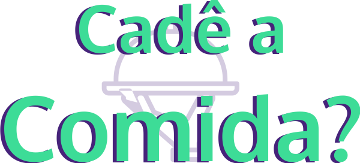

 

<h1 align='center'>
      
</h1>

 

<h1 align="center">
    
</h1>

<h2 title='#projeto'>
    Descrição
</h2>

O Cadê a Comida é uma plataforma capaz de centralizar as informações sobre os estabelecimentos de alimentação fora do lar presentes na região onde o usuário se encontra. Na plataforma, os donos dos estabelecimentos efetuam o cadastro dos mesmos, fornecendo algumas informações, entre elas o tipo de alimento disponível, sua localização no mapa, e um contato de Whatsapp. No que se refere aos usuários que desejam comer fora de casa, eles selecionam na página de busca o que deseja sair para comer, após a seleção o mapa é atualizado com pontos próximos a ele que fornecem o tipo de refeição que ele procura. Ao selecionar um estabelecimento, o usuário poderá entrar em contato com o mesmo por meio de Whatsapp, para efetuar um pedido para entrega ou retirada, fazer uma reserva.
