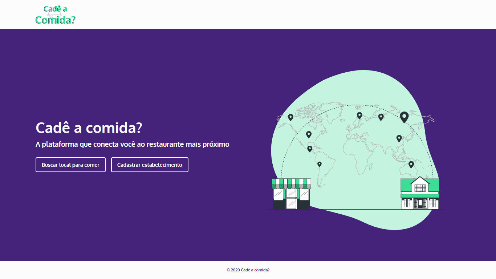

 

<h1 align='center'>
      
</h1>

 

<h1 align="center">
    
</h1>

<h2 title='#projeto'>
    Projeto
</h2>

API para o Cadê a Comida?, um aplicativo capaz de centralizar as informações sobre os estabelecimentos de alimentação fora do lar presentes na região onde o usuário se encontra.

<h2 title='#tecnologias'>
    Tecnologias
</h2>

Esse projeto foi desenvolvido com as seguintes tecnologias:

- Node.js
- PostgresSQL

<h2 title='#bibliotecas'>
    Bibliotecas
</h2>

Foram utilizadas as seguintes bibliotecas:

- express
- sequelize
- yup
- youch
- multer

<h2 title='#bibliotecas'>
    Instruções para rodar o projeto
</h2>

- yarn install (Instalar as dependência)
- Preencher .env com os dados no banco de dados e do sentry
- yarn migrate (Criar as tabelas do banco de dados)
- yarn seed (Povoar o banco com os tipos de estabelecimentos)
- yarn dev OU yarn start (Rodar a aplicação)

* O aplicativo roda na porta 3333 por padrão
