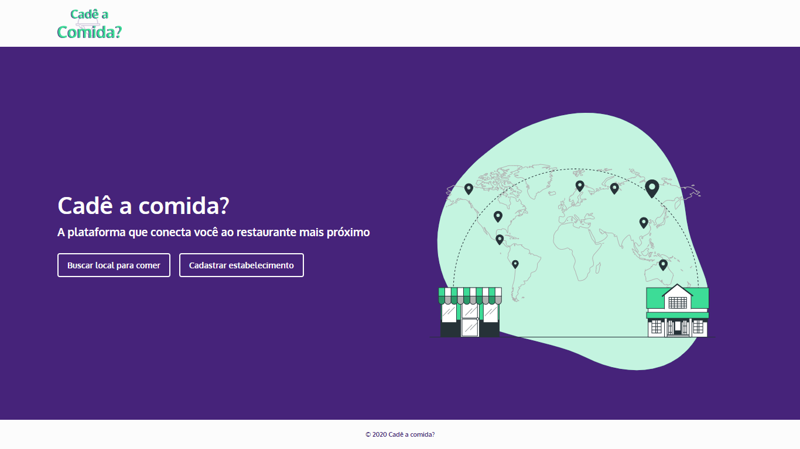

 

<h1 align='center'>
      
</h1>

 

<h1 align="center">
    
</h1>

<h2 title='#projeto'>
    Projeto
</h2>

Interface web para o Cadê a Comida?, um aplicativo capaz de centralizar as informações sobre os estabelecimentos de alimentação fora do lar presentes na região onde o usuário se encontra.

<h2 title='#tecnologias'>
    Tecnologias
</h2>

Esse projeto foi desenvolvido com as seguintes tecnologias:

- Reactjs

<h2 title='#bibliotecas'>
    Bibliotecas
</h2>

Foram utilizadas as seguintes bibliotecas:

- react-router-dom
- react-icons
- axios
- react-dropzone
- react-leaflet
- styled-components

Este projeto foi iniciado com [Create React App](https://github.com/facebook/create-react-app).

## Script de execução do projeto

No diretório do projeto, você pode executar:

### `yarn install`

Instala as dependências necessárias para a execução do projeto.  

### `yarn start`

Executa o aplicativo no modo de desenvolvimento.  
Abra [http://localhost:3000](http://localhost:3000) para visualizá-lo no navegador.
